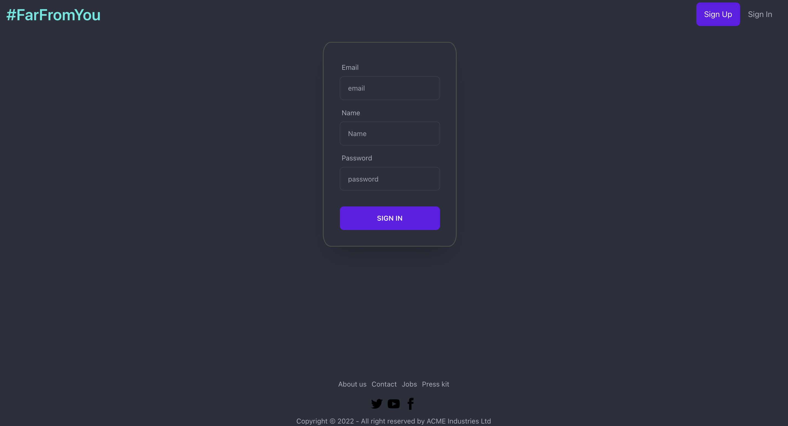
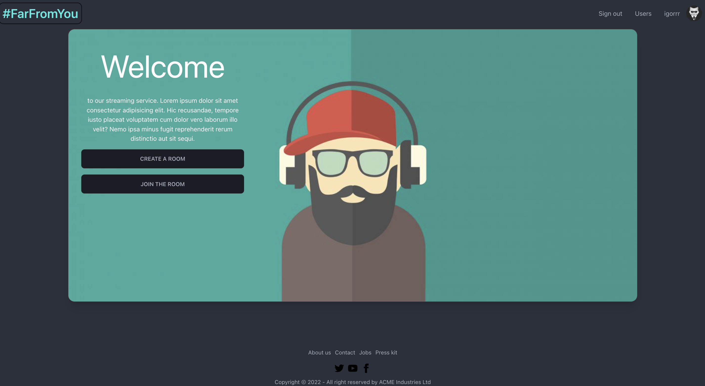
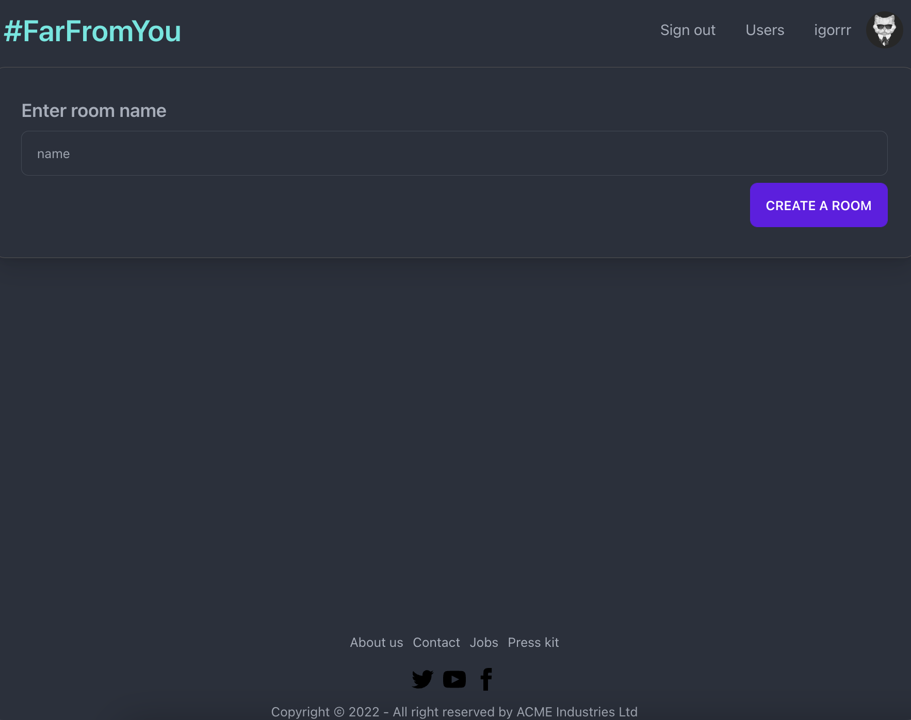
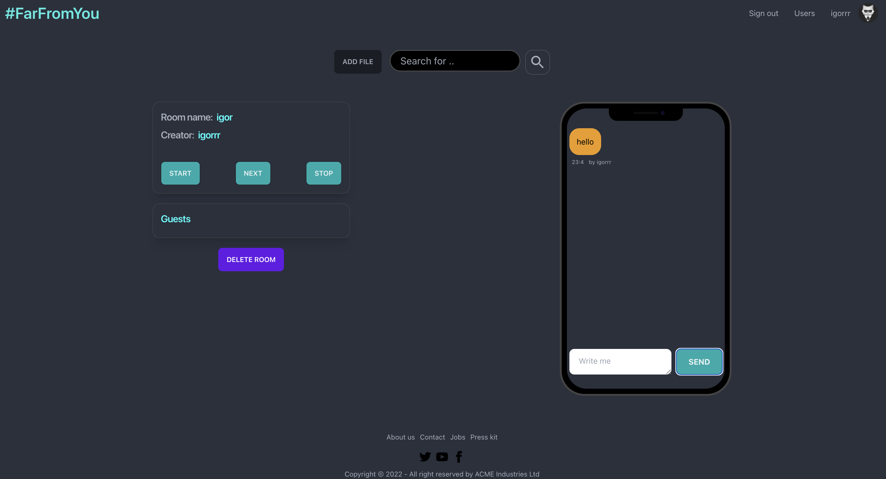
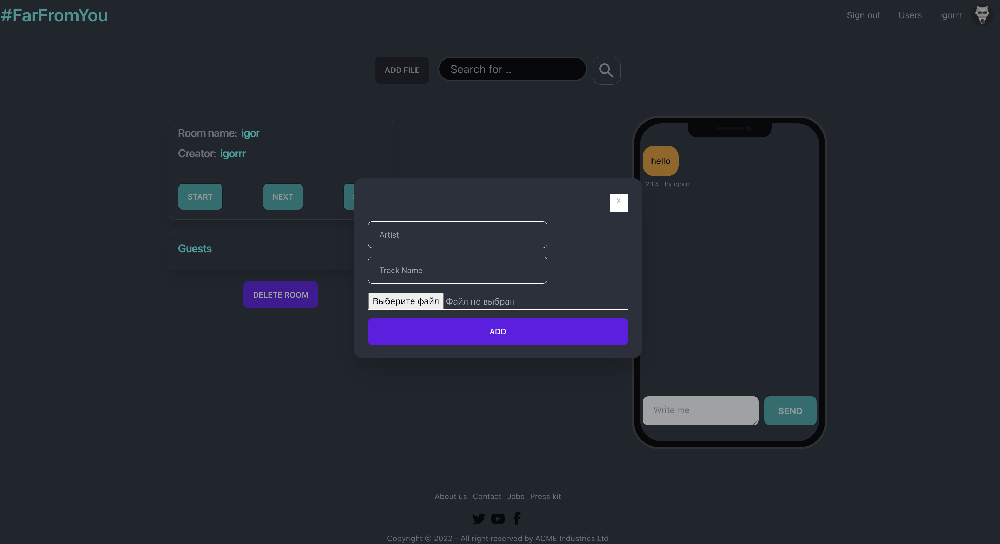

  # FarFromYou (командный проект)
<h3>
FarFromYou - это музыкальный проект для совместного прослушивания музыки компанией друзей с использованием socket.io
</h3>

<h4>
Представляем несколько принскринов нашего приложения:
</h4>

Для начала пользователю необходимо зарегестрироваться и только после этого он может зайти на главную страницу сайта

Вся информация о пользователе хранится в базе данных, пороль зашифрован. Почта пользователя должна быть уникальной

Далее пользователю доступно две кнопки - Создать комнату и Присоединиться к уже существующей. Мы создадим довую комнату и пройдем в нее

Пользователь, создавший комнату, выполняет роль сервера, а присоединившиеся - становятся клиентами, которым по сокетам передается таймкод играющего трека.
Треки добавляются по кнопке "Add file", добавлять могут все пользователи.

Создатель комнаты и ее гость может добавить любой трек в плеер, но гость не может переключать дорожки, эти права доступны тоько создателю комнаты. В нашем приложении есть возможнось общаться и отправлять своим друзьям сообщения, а они ответят вам

